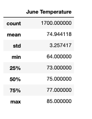
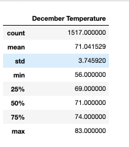
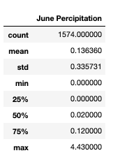
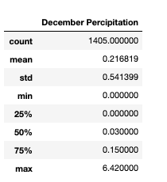

## Surfs_up
  ### Overview of the analysis:
  - Weather analysis for surfing and Ice-cream shop business.

  ### Purpose of the analysis:
  - The purpose of this project is to analyze Weather Data using SQLite and Flask to see if it is worth openning a surf shop on Oahu island.
  - Project involves gathering and analysing data based on the seasons, temperatures, percipitations.
  - Based on the anlaysis which season could effect surf and ice-cream shop business.

## Results:
### Results of the analysis based on the temperature data for months of June and December 
- ### June Temperature

Data count for June Tempratures are 1700 entries.
  1. The average temperature is 74.94 degrees fahrenheit
  2. The minimum temperature is 64 degrees fahrenheit
  3. The maximum temperature is 85 degrees fahrenheit

- ### December Temperature

Data count for December temperatures are 1517 entries.
  1. The average temperature is 71.04 degrees fahrenheit
  2. The minimum temperature is 56 degrees fahrenheit
  3. The maximum temperature is 83 degrees fahrenheit

## Summary:
   - 

For this part of the Challenge, write a report that describes the key differences in weather between June and December and two recommendations for further analysis.

The analysis should contain the following:

Overview of the analysis: Explain the purpose of this analysis.
Results: Provide a bulleted list with three major points from the two analysis deliverables. Use images as support where needed.
Summary: Provide a high-level summary of the results and two additional queries that you would perform to gather more weather data for June and December.
Deliverable 3 Requirements
Structure, Organization, and Formatting (6 points)
The written analysis has the following structure, organization, and formatting:

There is a title, and there are multiple sections. (2 pt)
Each section has a heading and subheading. (2 pt)
Links to images are working and displayed correctly. (2 pt)
Analysis (14 points)
The written analysis has the following:

Overview of the statistical analysis:

The purpose of the analysis is well defined. (3 pt)
Results:

There is a bulleted list that addresses the three key differences in weather between June and December. (6 pt)
Summary:

There is a high-level summary of the results and there are two additional queries to perform to gather more weather data for June and December. (5 pt)
